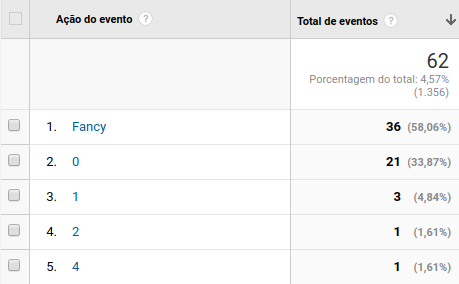
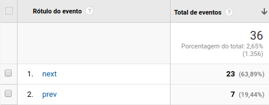
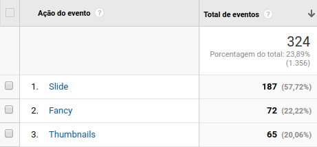
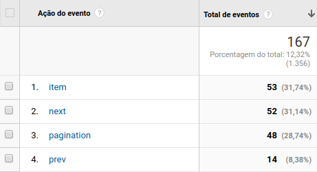
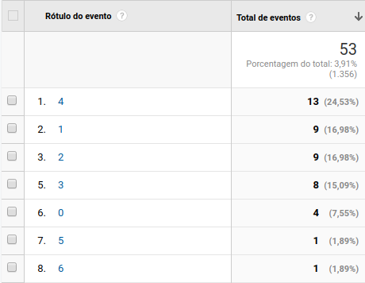
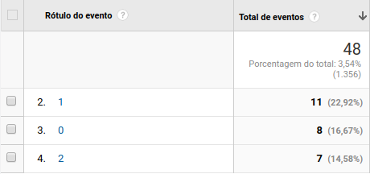
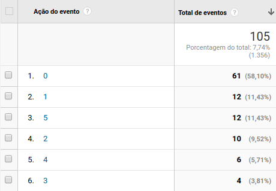
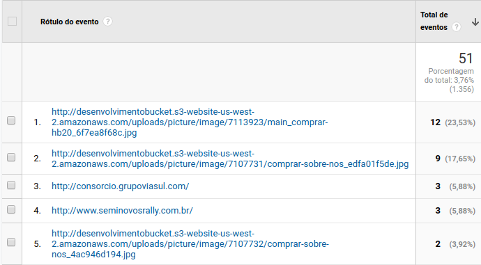
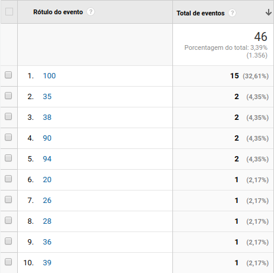

<!-- TITLE: Métricas de UX -->
<!-- SUBTITLE: Descrição dos eventos e dos dados enviados para o Analytics -->

### Dimensões
As dimensões são atributos personalizados dos dados enviados para o Google Analytics. Por exemplo, a dimensão "Produto" indica o produto da Autoforce em que a sessão iniciou. Atualmente as três dimensões configuradas são:
- Produto
- Domínio
- Controller 
#### Produto
A dimensão de produto pode ser organizada nos seguintes itens:
- Portal de Seminovos
- Site Padrão
- Site Viasul
- Portal Consórcio
- Portal Grupos
- Landing Page
- Grupo de Páginas
- Admin
- User Admin
#### Domínio
O domínio onde a sessão iniciou também é enviado como atributo dos dados. Ou seja, as informações podem ser analisadas de forma individual por domínio dos sites. 
#### Controller
Essa dimensão está sendo enviada no seguinte padrão:
`controller_name#action_name` (ex.: `pages#show`)

### Pesquisa Interna
O Google Analytics está configurado para registrar as buscas internas feitas nos sites. Por ser uma funcionalidade padrão, segue a estrutura normal da ferramenta.

### Eventos
Por padrão, o Google Analytics registra diversas métricas relacionadas aos usuários que acessam os sites. Mas além disso, criei eventos personalizados para captar dados de ações específicas. Os eventos listados abaixo podem ser acompanhados na área `Comportamento > Eventos > Principais Eventos` do Google Analytics. 
OBS.: Os dados nas imagens abaixo são fictícios e usados apenas como exemplo.
#### Galeria
Esse evento rastreia o comportamento do usuário dentro das galerias gerais dos sites. E para isso está configurado da seguinte forma:
**category**: Galeria
**action**: fancy | posição do item
**label**: next | prev
Exemplo: Acessando o evento na área `Principais Eventos`, temos uma tela como segue abaixo:

    

Para o item `fancy` (**action**), podemos ver que, com base em todos os eventos da galeria, **58,06%** aconteceram dentro do fancybox.
Seguindo o padrão da action `fancy`, os numeros isolados indicam a posição do elemento clicado na listagem. Analisando a imagem com os dados de teste, **33,87%** dos clicks nas fotos da galeria foram no primeiro elemento da listagem(posição zero).
Ainda sobre a action fancy, temos uma segunda métrica(**label**). Que indica os eventos que aconteceram exclusivamente dentro do shadowbox:

    

#### Galeria de Seminovos
No Portal de Seminovos temos a página interna com uma galeria principal, a ideia desse evento é enviar dados sobre o comportamento do usuário nessa área.
Essa área está dividida em 3 partes principais(actions) com suas respectivas subdivisões de eventos(labels):
**category**: Galeria de Seminovos
**action**: Slide | Fancy | Thumbnails
**label**: slide_item | slide_next | slide_prev | fancy_next | fancy_prev | thumb_item | thumb_next | thumb_prev | thumb_item | thumb_next |   thumb_prev

    

#### Carrossel
Os eventos principais de todos os carrosseis dos sites agora estão sendo rastreados, a estrutura de como foi organizado segue semelhantes as anteriores:
**category**: Carrossel
**action**: item | pagination | next | prev
**label**: posição do item(carrossel) | posição do item(paginação)
Exemplo:

    

A imagem anterior mostra o número de eventos por action:
- **item**: registra os clicks nos itens dentro do carrossel. Essa métrica também mostra qual a posição do elemento clicado dentro da lista(imagem abaixo). Por exemplo, **24,53%** dos clicks em itens de Carrossel acontecem na posição 4(item 5 da listagem).

    

- **pagination**: essa métrica mostra o comportamento nas paginações. Além do número de clicks em geral, é possível saber qual a posição do item clicado na paginação(imagem abaixo).

    

- **next**: apenas o número de clicks no botão de "Próximo".
- **prev**: apenas o número de clicks no botão de "Anterior".

#### Menu Geral
Os eventos que acontecem nesse menu registra os clicks nos itens e sub itens. A ideia é o registro apenas de dados, então o registro é de apenas posição dos itens.

    

#### Menu de Paginas
Esse menu segue a mesma linha do anterior, mas por ter um subnível a menos, então é possível registrar também se os itens clicados estavam no Topo da página, ou no Rodapé.
**category**: Menu de Páginas
**action**: Topo | Rodape
**label**: posição do item

#### Menu de Telefones
Eventos que acontecem em todos os menus que listam os telefones em dropdown. O registro segue o padrão de enviar apenas dados de posições, os números clicados, nesse caso, é irrelevante. 

#### Filtrar por categoria
Esse filtro é específico em alguns produtos, e o registro acontece separado em duas partes principais(actions), ou seja, menu de marcas e carrossel.
**category**: Menu de Páginas
**action**: menu | carrossel
**label**: item(carrossel) | pagination(carrossel) | next(carrossel) | prev(carrossel) | posição do item(menu)

#### Outbound Link
Esse evento registra o click em endereços externos ao site acessado.

    

#### Max Scroll
Registra a porcentagem de scroll dos usuários nas paginas.

    

